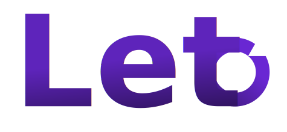

<h1>Projects</h1>

- [Leto](#leto)
- [Twitter Post Mockup](#twitter-post-mockup)
- [Social Media News Bot](#social-media-news-bot)
- [Chrome Link Extractor](#chrome-link-extractor)
- [Spyfall](#spyfall)
- [Werewolves Dawn](#werewolves-dawn)
- [Concept](#concept)
- [Rock, Paper, Scissors](#rock-paper-scissors)

Business
{: .label .label-purple}
Vue JS
{: .label .label-green }
Electron
{: .label}

# Leto
{: .mt-0}

Locally managed appointment and business manager for physiotherapy.

[Website](https://leto.andreasnicklaus.de){: .btn .btn-purple}
[Github](https://github.com/Calpollo/Leto){: .btn}

---

Astro
{: .label .label-purple }
API
{: .label .label-purple }
Project
{: .label .label-red }

# Twitter Post Mockup
{: .mt-0}

Create Mockup Tweets via URL-Parameters

[Try it out](https://twitter-post-mockup.vercel.app/){: .btn .btn-purple}
[Github](https://github.com/andreasnicklaus/twitter-post-mockup){: .btn}
[Documentation](https://github.com/andreasnicklaus/twitter-post-mockup/blob/main/README.md){: .btn }

---

Python
{: .label .label-blue }
Bot
{: .label .label-purple }
API
{: .label .label-purple }
Project
{: .label .label-red }

# Social Media News Bot
{: .mt-0}

Automated Bot to create Reels for Instagram.

[Instagram](https://instagram.com/your_social_media_news){: .btn .btn-purple}
[Github](https://github.com/Calpollo/Leto){: .btn}
[Documentation](https://andreasnicklaus.github.io/news-social-media/){: .btn }

---

{: .text-center}

Chrome Extension
{: .label }
JavaScript
{: .label .label-yellow }
Project
{: .label .label-red }

# Chrome Link Extractor
{: .mt-0}

Extract Emails and Links from any page and sites that are referenced by the page's sitemap.

[Github](https://github.com/andreasnicklaus/chrome-link-extractor){: .btn .btn-purple}

---

Multiplayer Game
{: .label }
Project
{: .label .label-red }
ReactJS
{: .label .label-blue }
NodeJS
{: .label .label-green }
Material UI
{: .label }

# Spyfall
{: .mt-0}

Mutliplayer Online Card Game about deception and tactical questioning

[Github](https://github.com/andreasnicklaus/spyfall){: .btn .btn-purple}

---

Multiplayer Game
{: .label }
Project
{: .label .label-red }
Angular
{: .label .label-red }
NodeJS
{: .label .label-green }

# Werewolves Dawn
{: .mt-0}

Mutliplayer Online Card Game based on the popular game `Werewölfe vom Düsterwald`

[Github](https://github.com/andreasnicklaus/werewolves-dawn){: .btn .btn-purple}

---

Multiplayer Game
{: .label }
Project
{: .label .label-red }
VueJS
{: .label .label-green }
NodeJS
{: .label .label-green }

# Concept
{: .mt-0}

Mutliplayer Online Board Game for guessing words based on placed markers

[Github](https://github.com/andreasnicklaus/concept-game){: .btn .btn-purple}

---

Simulation
{: .label }
Project
{: .label .label-red }
VueJS
{: .label .label-green }

# Rock, Paper, Scissors
{: .mt-0}

Simulation of independent figures playing rock, paper, scissors

[Website](https://rps.andreasnicklaus.de/){: .btn .btn-purple}
[Github](https://github.com/andreasnicklaus/rockpaperscissors){: .btn}

---

<a href="https://github.com/andreasnicklaus" class="btn">More Projects on Github</a>

